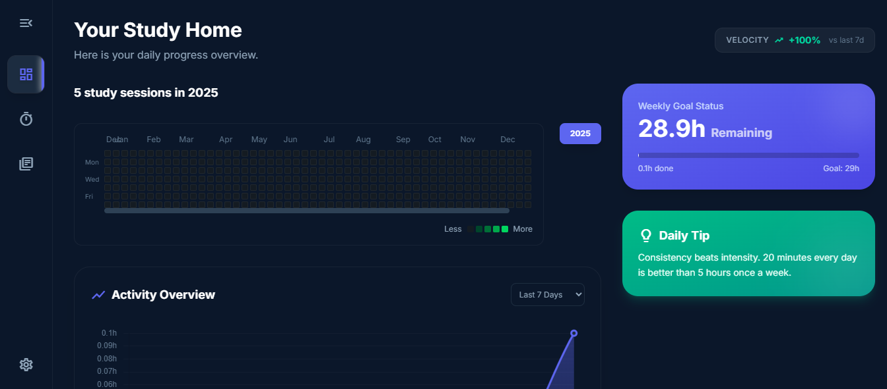

# StudyGO v1.1.0

**StudyGO** is a premium, high-performance study companion designed to help students track their learning progress, build consistent study habits, and visualize their academic journey through a beautiful, cloud-synced interface.



## Key Features

### Secure Authentication & Personalization
*   **Custom Profiles**: Sign up with a unique username that personalizes your entire dashboard experience.
*   **Secure Sign-In**: Powered by Supabase Auth for high-security email/password protection.
*   **Instant Access**: Login/signup flows with real-time validation and smooth transitions.

### Advanced Data Visualization
*   **Activity Heatmap**: A GitHub-inspired contribution grid that tracks study frequency over the entire year.
*   **Dynamic Year Selector**: Effortlessly browse study history year-by-year.
*   **Focus Analytics**: Interactive line charts powered by Chart.js to visualize focus hours over 7 or 30 days.

### Immersive Focus Timer
*   **Zen Mode**: A distraction-free "Flow State" overlay with a minimalist countdown and circular progress ring.
*   **Granular Tracking**: Link sessions directly to specific subjects and topics for precise progress reporting.
*   **Quick Presets**: Rapid-start buttons (15m, 25m, 45m, 60m) to jump straight into deep work.

### Premium UI/UX
*   **Custom Notification System**: Aesthetic "Toast" notifications for instant feedback without browser alerts.
*   **Contextual Modals**: Beautifully blurred confirmation pop-ups for critical actions like deletion or logouts.
*   **High-Speed Navigation**: JavaScript-optimized view transitions that make the app feel instant and responsive.

### Goal Management
*   **Dynamic Weekly Targets**: Automatically calculates weekly study goals based on individual subject and topic targets.
*   **Victory Celebration**: Confetti bursts celebrate wins when you hit weekly study milestones!

## Tech Stack

*   **Frontend**: Vanilla JavaScript (ES6+), HTML5
*   **Styling**: Tailwind CSS & CSS3 Animations
*   **Backend & DB**: Supabase (PostgreSQL, Real-time Sync, RLS Security)
*   **Visualization**: Chart.js
*   **Date Processing**: date-fns
*   **Effects**: Canvas Confetti

## Getting Started

1.  **Clone the project**:
    ```bash
    git clone https://github.com/AuthenticPaulMeyers/StudyGo.git
    ```
2.  **Install dependencies**:
    ```bash
    npm install
    ```
3.  **Environment Variables**:
    Create a `.env` file in the root and add your Supabase credentials:
    ```env
    VITE_SUPABASE_URL=your_project_url
    VITE_SUPABASE_ANON_KEY=your_anon_key
    ```
4.  **Run in development mode**:
    ```bash
    npm run dev
    ```

## Security & Privacy
With the migration to Supabase, data is now securely stored in the cloud, allowing users to access study history across multiple devices. All data is protected by **Row Level Security (RLS)**, ensuring that only users can access their personal study logs and settings.

---
*Built with 💖 for students who strive for excellence. Lock In, Grind.*
